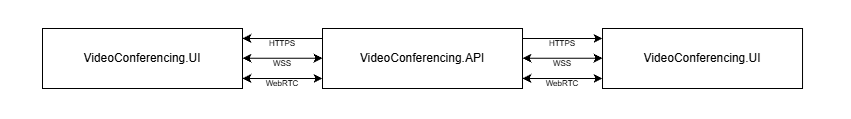

# VideoConferencing

[](https://github.com/DanielMigchels/VideoConferencing/actions/workflows/dotnet-build.yml) [](https://hub.docker.com/r/danielmigchels/videoconferencing)

A self-hostable video conferencing solution that does not rely on third-party SFU services or cloud dependencies.


# Purpose of project

Through my experience working with various software companies and teams, I've observed that real-time video communication is considered a significant challenge, despite high demand from customers in sectors like e-commerce, healthcare, and legal services for secure video calling capabilities.

This project represents my research into this domain and provides a proof of concept for video calling connections while exploring WebRTC and RDP protocols.

## How does it work?

This project provides video calling without an SFU. The backend forwards RTP packets through the server to other clients. Media uses UDP. When running in Docker, publish a UDP range (for example `50000-50100/udp`). Set `HOST` to the IP address that other clients can reach (for example your LAN IP). This is used to advertise a host-reachable address for ICE.



#### Protocols
- **HTTPS** - Serves the static web application to clients
- **WSS (WebSocket Secure)** - Handles real-time signaling between clients and server for room management, peer discovery, and WebRTC session negotiation (offer/answer exchange)
- **WebRTC** - Establishes media connections for transmitting audio and video RTP streams between participants

#### Applications
- **VideoConferencing.UI** - Angular-based frontend that handles the user interface, captures local media streams, manages WebRTC peer connections, and renders remote video feeds
- **VideoConferencing.API** - .NET backend that coordinates signaling over WebSockets, manages room state, and forwards RTP media packets between participants using SIP Sorcery for WebRTC processing

## How to Run

Instructions for running the application.

### Docker Run
Pull the image from Docker Hub and run it locally.

> **Important:** Replace `HOST=192.168.1.100` with the IP address of your host machine.

```bash
docker run -e HOST=192.168.1.100 -p 8443:8443 -p 50000-50100:50000-50100/udp danielmigchels/videoconferencing
```
The app listens on port 8443 and is available over HTTPS at `https://localhost:8443`.
The container uses a self-signed certificate; browser warnings can be ignored.

## Future Improvements

- **SDP renegotiation** for multi-user conversations.
- **Observability** (structured logs, metrics, health checks, basic call diagnostics).
- **Explore an SFU path** (e.g. mediasoup) for scalability and bandwidth efficiency.
